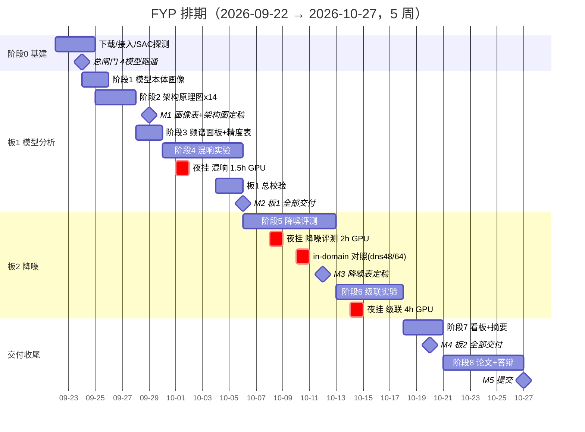
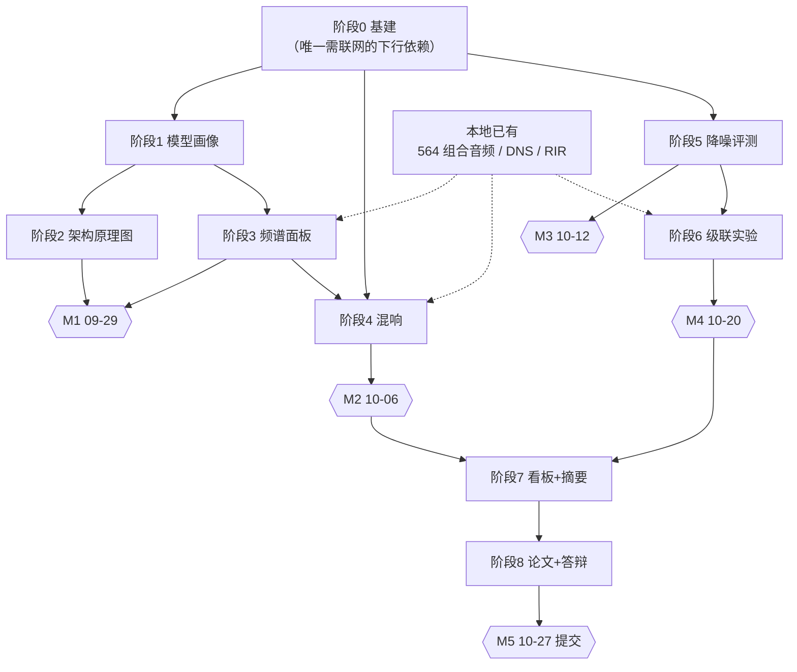

# FYP 项目计划与任务拆解

> 版本：v1.0 ｜ 制定日：2026-09-22（周二）｜ 项目根：`E:\FYP_HKBU`
> 目标交付日：**2026-10-27（周二）**，共 5 周
> 配套技术文档：`FYP_ROADMAP_2026-09-22.md`（讲"做什么、为什么"）；**本文件讲"谁在什么时候交付什么、怎么验收"**
> 原则：所有指标**本机实测**；任何跨模型比较先声明口径；坏消息优先暴露。

---

## 0. 一页纸总览

### 0.1 已确认的项目前提（本次取证）

| 项 | 取值 | 来源 |
|---|---|---|
| 硬性交付期 | **2026-10-27**（约 5 周） | 本次确认 |
| 挂机窗口 | **可通宵**（每晚 6~10 h 连续可用） | 本次确认 |
| 人力 | 单人（你）+ AI 助手执行 | 既有事实 |
| 计算资源 | RTX 4070 Laptop 8 GiB；E: 剩 **62 GB** / C: 剩 **400 GB** | 本机实测 |
| 网络 | GitHub / HuggingFace / Edinburgh DataShare 可达 | 已验证 |

### 0.2 两个板块与 5 个里程碑

| 里程碑 | 日期 | 验收物（一句话） |
|---|---|---|
| **M1** | 2026-09-29 | 模型画像表（16 模型）+ 14 张架构原理图定稿 |
| **M2** | 2026-10-06 | 频谱面板系列 + 混响实验完成 → **板 1 全部交付** |
| **M3** | 2026-10-12 | 降噪双口径评测表定稿（含 in-domain 对照） |
| **M4** | 2026-10-20 | 级联实验结论 + 3 个离线看板 → **板 2 全部交付** |
| **M5** | 2026-10-27 | 论文图表 + 答辩材料 + 全链路复现性检查 → **提交** |

### 0.3 只在 3 个夜里挂 GPU

| 夜 | 实验 | GPU 时长 |
|---|---|---|
| 第 1 夜（10-01） | 混响 / 去混响 | ~1.5 h |
| 第 2 夜（10-08） | 降噪评测 | ~2 h |
| 第 3 夜（10-14） | 级联实验 | ~4 h |

**总计约 7.5 h GPU，分散在 3 个夜里**——这是本项目唯一的串行硬约束，其余工作全是 CPU/出图/写作，可白天推进。

---

## 1. 范围定义

### 1.1 在范围内（In Scope）

1. **板 1 源分离模型分析**：模型容量画像（参数/FLOPs/显存/时延）、架构原理图、信号级频谱面板、混响/去混响/去回声实验
2. **板 2 降噪**：`facebookresearch/denoiser` + `Mel-RoFormer-Denoise-Aufr33` 在 Valentini + DNS 上的评测；**降噪→分离级联实验**
3. **交付形态**：论文可用图表 + 3 个离线 HTML 看板 + 4 份数据摘要 + 答辩材料 + 可复现脚本

### 1.2 明确不在范围内（Out of Scope，防止范围蔓延）

| 不做 | 原因 |
|---|---|
| **降噪模型微调** | 已拍板不做（会破坏与 pretrained 的可比性） |
| **补跑 BSRNN-SIMO 的 36 首** | 已拍板暂不补 → 保留 14/50，报告显式标注截断 |
| 复现 RPCA+DRNN | 论文未公开代码（09-19 审计结论） |
| 复现 Pac-HuBERT-SEP | MERL 未发布 |
| 逐格对齐参考论文数值 | 需原版 Demucs(v1) + 官方 DPRNN-TasNet 权重，成本高收益低（详见路线图 §7） |
| lyrics-game 子项目 | 与主线无代码耦合，P3 待办 |

> ⚠️ **范围变更须走流程**：任何新增实验，先问三个问题——① 是否影响 M1~M5 中任一里程碑？② 砍掉什么来换？③ 谁批准？三个都答不上就不做。

---

## 2. 交付物清单与完成定义（DoD）

### 2.1 板 1 交付物

| # | 交付物 | 落点 | DoD（怎么算"做完了"） |
|---|---|---|---|
| D1 | 模型画像表 | `data/model_analysis/model_profile.csv` | 16 行**零缺失**；FLOPs 与 thop 交叉验证偏差 <5%，超标的逐条标注 |
| D2 | 架构原理图 ×14 | `figures/model_arch/*.png` | 每张图的 shape 标注能在 `graph_*.json` 溯源；参数量占比之和 = 100% |
| D3 | 频谱面板系列 | `figures/spectrograms/*.png` | 3 首歌 × 6 面板统一色标；BSS-Eval 四分量之和与估计的残差 ≈ 0 |
| D4 | 混响实验图组 | `figures/reverb/*.png` | RIR 本体图 + 6 面板 + T60→ΔSDR 退化曲线齐全 |
| D5 | 精度表（参考表样式） | `docs/MEDIAN_TABLE*.md` 重绘版 | 主副表分明；脚注写明口径与参考表差异原因 |

### 2.2 板 2 交付物

| # | 交付物 | 落点 | DoD |
|---|---|---|---|
| D6 | 降噪评测表 | `data/denoise/denoise_eval.csv` | **双口径分开报**；**in-domain 对照（dns48/dns64 vs master64）必须在表内** |
| D7 | 降噪图组 | `figures/denoise/*.png` | 频谱前后对比 + 指标条形 + dry/wet 曲线 |
| D8 | 级联 ΔSDR 矩阵 | `data/cascade/cascade_eval.csv` | L0×L1×L2×L3 × 4 SNR 全格填满；每格标注可复现命令 |
| D9 | 级联图组 | `figures/cascade/*.png` | 按 SNR 分箱的 ΔSDR 图；含"变差也是结论"的显式说明 |

### 2.3 收尾交付物

| # | 交付物 | 落点 | DoD |
|---|---|---|---|
| D10 | 3 个离线看板 | `html/model_analysis_dashboard.html` 等 | **双击即可开**，图片内嵌，无任何外部依赖 |
| D11 | 4 份数据摘要 | `docs/MODEL_PROFILE_*.md` 等 | 数字可与 CSV 逐一对齐，可被论文直接引用 |
| D12 | 论文图表包 | 论文正文插图 | 全部 300 dpi，图注含口径三要素（数据集/片段/指标定义） |
| D13 | 答辩材料 | `slides/` | 能 15 分钟讲完"模型怎么运行 + 两板块怎么缝合" |
| D14 | 复现性检查 | 项目根 `README.md` + 一键脚本 | 他人按 README 能复跑任一图表 |

---

## 3. WBS 任务拆解

> 负责人：**助手** = AI 执行；**你** = 决策与验收；**导师** = 待确认项。
> 预估工时以"助手执行 + 你验收"计；GPU 时长单列。

### 阶段 0 · 基建与准入（2026-09-22 夜 ~ 09-24）

| ID | 任务 | 产出 | 负责人 | 依赖 | 验收标准 | 预估 |
|---|---|---|---|---|---|---|
| T0.1 | 下载 Valentini testset（163+147 MB） | `02_databases/Valentini/` | 助手 | 无 | 824 noisy + 824 clean **配对**齐全 | 20 min |
| T0.2 | 下载 Valentini 28spk trainset（≈5 GB） | 同上 | 助手 | T0.1 | 文件数与官方清单一致 | 1 h（后台） |
| T0.3 | clone `facebookresearch/denoiser` + 装进 venv | `01_models/_third_party/denoiser` | 助手 | 无 | ① `import denoiser` 成功 ② **SAC 功能性探测通过**（不信历史记录） | 40 min |
| T0.4 | 下载 Mel-RoFormer-Denoise 2 个 ckpt（1.8 GB）+ yaml | `01_models/_weights/` | 助手 | 无 | 逐键 load `missing=0 / unexpected=0` | 1 h（后台） |
| T0.5 | 下载 2 个去混响/去回声 ckpt | 同上 | 助手 | 无 | 同上 | 1 h（后台） |
| T0.6 | 确认 ZFTurbo clone 含 `mel_band_roformer` denoise 配置，缺则升级 | — | 助手 | 无 | 能加载 D6 的 yaml | 30 min |
| T0.7 | 建目录骨架（5 figures + 4 data） | 空目录 | 助手 | 无 | 路径符合落点规则 | 10 min |

**阶段 0 总闸门**：4 个新模型（denoiser ×2 ckpt + denoise-Mel-RoFormer ×2 + dereverb ×2）**各自跑通一次 10 s 前向并落盘 wav**，且结果 JSON 里 `status = PASS`。
> 🔴 判成功**只看结果 JSON 的 status**，不看目录是否存在、不看返回码（本项目踩过"假 PASS"）。

### 阶段 1 · 模型本体画像（09-24 ~ 09-25）

| ID | 任务 | 产出 | 负责人 | 依赖 | 验收标准 | 预估 |
|---|---|---|---|---|---|---|
| T1.1 | 写 `_measure_model_profile.py`（**复用** `benchmark_model_universal.py::REGISTRY` 的 loader） | 脚本 | 助手 | 阶段 0 | 不重写加载链路（防口径分裂） | 2 h |
| T1.2 | 静态量：参数量 / 权重体积 / 输出轨数 / 采样率 | CSV 列 | 助手 | T1.1 | 16 模型全覆盖 | 30 min |
| T1.3 | FLOPs：`FlopCounterMode` 实测 + thop 交叉验证 | CSV 列 | 助手 | T1.1 | 偏差 <5%，超标的标注 | 1 h |
| T1.4 | 峰值显存 + 单次前向时延（预热 5 次取中位） | CSV 列 | 助手 | T1.1 | 显存取 `max_memory_allocated` | 1 h |
| T1.5 | 出图：`params_flops.png`（双轴）+ `profile_pareto.png`（气泡） | 2 PNG | 助手 | T1.2–T1.4 | 分组呈现（四轨/单目标/解析组） | 1 h |

**口径写死**：44.1 kHz 立体声、输入 **10 s**、FLOPs 按 **2×MACs**、RTF 标注机器负载。

### 阶段 2 · 架构原理图 ×14（09-25 ~ 09-27）

| ID | 任务 | 产出 | 负责人 | 依赖 | 验收标准 | 预估 |
|---|---|---|---|---|---|---|
| T2.1 | `_extract_model_graph.py`：forward hook 抓真实层级与 shape | `graph_*.json` ×14 | 助手 | T1.1 | 含（模块类名/输入 shape/输出 shape/参数量）完整树 | 3 h |
| T2.2 | `_plot_model_arch.py`：左概念流程 + 右真实层级条带 | 渲染器 | 助手 | T2.1 | 数据驱动，非手绘想象 | 3 h |
| T2.3 | 14 张图逐张自查（你参与） | 14 PNG | 你 + 助手 | T2.2 | shape 可溯源；占比和=100%；角标有论文引用+本机路径 | 2 h |
| T2.4 | 补变换层直观图（复用既有 `fig3/fig4_spectrogram_*`） | 引用 | 助手 | — | 不重复造图 | 30 min |

### 阶段 3 · 频谱面板 + 精度表重绘（09-28 ~ 09-29，**零推理**）

| ID | 任务 | 产出 | 负责人 | 依赖 | 验收标准 | 预估 |
|---|---|---|---|---|---|---|
| T3.1 | `_make_spectrogram_panels.py`（读 `03_outputs/_test_run/`，不重推理） | 脚本 | 助手 | 无 | 直接复用 564 组合音频 | 2 h |
| T3.2 | 6 面板：Mixture/Target/Estimate/Interference/Artifacts/多模型并排 | PNG ×3 歌 | 助手 | T3.1 | **BSS-Eval 四分量之和 ≈ 估计**（残差校验） | 2 h |
| T3.3 | 机制图：掩码可视化 + band-split 频带边界 | PNG | 助手 | T3.1 | 能看出"模型怎么切的" | 1.5 h |
| T3.4 | 按参考表样式重绘 Average SDR 表 + 脚注口径 | MD + PNG | 助手 | 无 | 主表用本机实测；脚注说明与参考表差异 | 1.5 h |

### 阶段 4 · 混响 / 去混响 / 去回声（09-30 ~ 10-05，**夜挂 1.5 h GPU**）

| ID | 任务 | 产出 | 负责人 | 依赖 | 验收标准 | 预估 |
|---|---|---|---|---|---|---|
| T4.1 | `_reverb_experiment.py` + RIR 选取（小房间 T60≈0.6 s / 大厅 T60≈1.2 s） | 脚本 + RIR 清单 | 助手 | 阶段 0 | 用本机 60248 条 RIR | 2 h |
| T4.2 | 四段生成：干 / 加混响 / 去混响输出 / 残差 | 音频 | 助手 | T4.1 | 3 歌 × 2 档 | — |
| T4.3 | **夜挂**：84 组合推理 | 结果 JSON | 助手 | T4.2 | 独立结果文件，不污染主表 | 1.5 h GPU |
| T4.4 | RIR 本体图（波形 + 能量衰减 EDT/T30） | PNG | 助手 | T4.3 | 这才配叫 Reverberation | 1.5 h |
| T4.5 | T60 → ΔSDR 退化曲线（现有 12 模型） | PNG | 助手 | T4.3 | 分模型曲线 | 1.5 h |
| T4.6 | 回声实验：人工延迟回声 → de-echo 前后 | PNG | 助手 | T4.1 | 对应 Target Echo 面板 | 1.5 h |
| T4.7 | **板 1 总校验**：口径/脚注/可溯源 | 检查清单 | 你 + 助手 | T1–T4 | 每条数字能指到 CSV | 2 h |

### 阶段 5 · 降噪评测（10-06 ~ 10-12，**夜挂 2 h GPU**）

| ID | 任务 | 产出 | 负责人 | 依赖 | 验收标准 | 预估 |
|---|---|---|---|---|---|---|
| T5.1 | `_denoise_eval.py` 统一入口（服务工具 A/B × 两数据集） | 脚本 | 助手 | 阶段 0 | 一个入口，不分叉 | 3 h |
| T5.2 | **主口径**（统一 16 kHz）：PESQ-WB / STOI / SI-SDR | CSV | 助手 | T5.1 | 跨模型唯一公平比较处 | 1.5 h |
| T5.3 | **副口径**（原生率）：SI-SDR / LSD / Mel 距离 | CSV | 助手 | T5.1 | PESQ/STOI 在此不适用，须标注 | 1.5 h |
| T5.4 | ⚠️ **in-domain 对照**：`master64` vs `dns48`/`dns64` | CSV 列 | 助手 | T5.2 | **必进表**，否则结论站不住 | 1 h |
| T5.5 | dry/wet 曲线（denoiser `--dry`） | PNG | 助手 | T5.2 | 降噪强度 vs 指标 | 1 h |
| T5.6 | 频谱前后对比图组 | PNG | 助手 | T5.2 | 4 组（2 工具 × 2 数据集） | 1.5 h |

### 阶段 6 · 级联实验（10-13 ~ 10-17，**夜挂 4 h GPU**）

| ID | 任务 | 产出 | 负责人 | 依赖 | 验收标准 | 预估 |
|---|---|---|---|---|---|---|
| T6.1 | 造测试集：MUSDB test 取 10 首 × 4 SNR 加 DNS 噪声 | noisy 音频 + GT | 助手 | T5.1 | 有 GT，可算 ΔSDR | 1.5 h |
| T6.2 | **夜挂**：L0/L1/L2/L3 × 4 模型（Demucs/MDX/BSRNN-opt/UMX） | 结果 JSON | 助手 | T6.1 | 640 组合 | 4 h GPU |
| T6.3 | ΔSDR 矩阵 + 按 SNR 分箱图 | CSV + PNG | 助手 | T6.2 | 每格标可复现命令 | 2 h |
| T6.4 | 诚实性检查：结果变差也照报 | 结论段 | 你 + 助手 | T6.3 | 明确写出域外泛化结论 | 1 h |

### 阶段 7 · 看板与摘要（10-18 ~ 10-20）

| ID | 任务 | 产出 | 负责人 | 依赖 | 验收标准 | 预估 |
|---|---|---|---|---|---|---|
| T7.1 | 看板 1：模型分析 | HTML | 助手 | 阶段 1–4 | 离线可开、图内嵌 | 2 h |
| T7.2 | 看板 2 + 3：降噪 / 级联 | HTML ×2 | 助手 | 阶段 5–6 | 同上 | 3 h |
| T7.3 | 4 份数据摘要 docs | MD ×4 | 助手 | 各阶段 | 数字与 CSV 对齐 | 2 h |

### 阶段 8 · 论文与答辩收尾（10-21 ~ 10-27）

| ID | 任务 | 产出 | 负责人 | 依赖 | 验收标准 | 预估 |
|---|---|---|---|---|---|---|
| T8.1 | 图表入论文（板 1） | 论文插图 | 助手 | M2 | 300 dpi + 口径三要素图注 | 3 h |
| T8.2 | 图表入论文（板 2） | 论文插图 | 助手 | M4 | 同上 | 3 h |
| T8.3 | 口径与差异说明章节 | 论文章节 | 助手 | T8.1–T8.2 | 挡掉"为什么和参考表不一样"的提问 | 2 h |
| T8.4 | 答辩 Slides | `slides/` | 助手 + 你 | T8.1–T8.3 | 15 分钟讲完两板块 | 3 h |
| T8.5 | 全链路复现性检查 | README + 一键脚本 | 助手 | 全部 | 按 README 能复跑任一图 | 2 h |
| T8.6 | 最终校对与提交 | — | 你 | T8.5 | M5 | — |

---

## 4. 排期

### 4.1 甘特图



### 4.2 周历（逐日）

| 日期 | 星期 | 主任务 | 夜间 |
|---|---|---|---|
| 09-22 | 二 | **今晚即可启动 T0.1/T0.3/T0.4/T0.5 下载** | 下载（无 GPU） |
| 09-23 | 三 | 阶段 0 接入 + SAC 探测；T1.1 写脚本 | 下载续 |
| 09-24 | 四 | **阶段 0 总闸门** + T1.2–T1.4 | — |
| 09-25 | 五 | T1.5 出图 + T2.1 起步 | — |
| 09-26 | 六 | T2.1–T2.2 完成 | — |
| 09-27 | 日 | T2.3 你逐张验收（14 图） | — |
| 09-28 | 一 | T3.1–T3.2 频谱面板 | — |
| 09-29 | 二 | **M1 评审** + T3.4 精度表重绘 | — |
| 09-30 | 三 | T4.1 混响脚本 + RIR 选取 | — |
| 10-01 | 四 | T4.2 四段生成 | **混响 1.5 h GPU** |
| 10-02 | 五 | T4.4 RIR 本体图 | — |
| 10-03 | 六 | T4.5 退化曲线 + T4.6 回声 | — |
| 10-04 | 日 | T4.7 板 1 总校验 | — |
| 10-05 | 一 | 板 1 补漏 + **M2 预检** | — |
| 10-06 | 二 | **M2 验收（板 1 交付）** + T5.1 起步 | — |
| 10-07 | 三 | T5.2 主口径 16 kHz | — |
| 10-08 | 四 | T5.2 续 | **降噪评测 2 h GPU** |
| 10-09 | 五 | T5.3 副口径原生率 | — |
| 10-10 | 六 | **T5.4 in-domain 对照（必做）** | — |
| 10-11 | 日 | T5.5 dry/wet + T5.6 频谱图组 | — |
| 10-12 | 一 | **M3 评审**（降噪表定稿） | — |
| 10-13 | 二 | T6.1 造带噪测试集 | — |
| 10-14 | 三 | T6.2 启动 | **级联 4 h GPU** |
| 10-15 | 四 | T6.3 ΔSDR 矩阵 | — |
| 10-16 | 五 | T6.3 分箱图 + T6.4 诚实性检查 | — |
| 10-17 | 六 | 板 2 补漏 | — |
| 10-18 | 日 | T7.1 看板 1 | — |
| 10-19 | 一 | T7.2 看板 2+3 | — |
| 10-20 | 二 | **M4 验收（板 2 交付）** | — |
| 10-21 | 三 | T7.3 + T8.1 图表入论文 | — |
| 10-22 | 四 | T8.1 续 | — |
| 10-23 | 五 | T8.2 板 2 图表入论文 | — |
| 10-24 | 六 | T8.3 口径差异章节 | — |
| 10-25 | 日 | T8.4 答辩 Slides | — |
| 10-26 | 一 | T8.5 复现性检查 + 校对 | — |
| 10-27 | 二 | **M5 提交** | — |

**缓冲**：周末（09-26/27、10-04/05、10-11/12、10-18/19）本身即缓冲带。若某阶段延后 ≤2 天，用周末吸收；延后 >2 天，启动 §6 的追赶预案。

---

## 5. 任务依赖关系



**关键路径**：`阶段0 → 阶段5 → 阶段6 → 阶段7 → 阶段8 → M5`。
**可并行**：板 1（阶段 1–4）与板 2 的阶段 5 之间无硬依赖，若下载受阻，板 1 可先全速推进。

---

## 6. 风险登记册

> 区分「风险」（未发生，用预案）与「问题」（已发生，用行动项）。

| # | 类型 | 风险描述 | 概率 | 影响 | 应对策略 | 触发信号 | 负责人 |
|---|---|---|---|---|---|---|---|
| R1 | 技术 | **采样率不可比**：16 k / 44.1 k / 48 k 三套并存，PESQ 在 48 k 上跑是错的 | 高 | 高 | **规避**：固定双口径（主 16 k / 副原生率），绝不混表 | 出现跨模型 PESQ 对比表 | 助手 |
| R2 | 技术 | **in-domain 污染**：`master64` 训练集含 Valentini | 已确认 | 高 | **缓解**：强制并列 `dns48`/`dns64` 对照 | 表中只有 master64 一行 | 助手 |
| R3 | 合规 | 两个降噪/去混响模型是**社区模型**，非同行评议论文；denoiser 为 **CC-BY-NC 4.0 非商用** | 已确认 | 中 | **缓解**：报告显式标注来源、性质与许可 | 报告未出现来源说明 → 视为未完成 | 你 |
| R4 | 依赖 | 阶段 0 需联网下载 ≈8 GB，是**唯一串行前置** | 中 | 高 | **缓解**：板 1（阶段 1–4）资产全在本地，可先全速推进；下载走断点续传 | 下载失败 → 立即转板 1 | 助手 |
| R5 | 环境 | **SAC 拦截新装 dll**（denoiser 首次 import） | 中 | 中 | **缓解**：先功能性探测；**历史"被拦截"记录不采信** | `WinError 4551` 且提示"应用程序控制策略已阻止" | 助手 |
| R6 | 技术 | ZFTurbo 本地 clone 版本旧，可能不含 denoise 配置 | 中 | 中 | **缓解**：T0.6 先行确认，缺则升级 | 加载 yaml 报未知 model_type | 助手 |
| R7 | 口径 | FLOPs 歧义（MACs vs FLOPs、序列长） | 中 | 中 | **规避**：写死 10 s + 2×MACs，图表脚注标明 | 出现无法解释的倍数差异 | 助手 |
| R8 | 计量 | RTF 受机器负载影响，通宵跑与白天跑数值不可比 | 高 | 中 | **缓解**：报区间 + 标注机器状态；时间类指标不用单点下结论 | 同一模型两次 RTF 差 >2× | 助手 |
| R9 | 资源 | 磁盘：新增约 17 GB（数据 6 + 权重 2 + 产物 9） | 低 | 中 | **缓解**：E 剩 62 GB；产物存 FLAC；必要时落 C 盘 400 GB | E 盘可用 <15 GB | 助手 |
| R10 | 口径 | **单目标 vs 四轨模型 SDR 不可横比** | 高 | 高 | **规避**：保持分组纪律，图/表都分组标注 | 出现把 L12 与 Demucs 同轴比较 | 助手 |
| R11 | 数据 | DPRNN 是自训权重、11.025 kHz、四轨 SDR 为负 | 已确认 | 低 | **接受**：只作负面证据，引用必注 ckpt step | — | 助手 |
| R12 | 结论 | 级联实验可能得到"变差"的结果 | 中 | 中 | **接受**：照实报，这是有价值的域外泛化结论 | 结果与预期相反时不得挑数据 | 你 |
| R13 | 流程 | 长任务被会话结束杀掉（本项目已踩过一次） | 高 | 高 | **规避**：一律走 `schtasks`，**不用**后台任务 | 锁文件残留 + 进程消失 | 助手 |
| R14 | 流程 | 单模型塞进同一进程会 **OOM**（8 GiB 卡，已实测） | 已确认 | 中 | **规避**：每组合独立子进程（非浪费，是显存隔离） | `CUDNN_STATUS_INTERNAL_ERROR_HOST_ALLOCATION_FAILED` | 助手 |
| R15 | 进度 | 10 月底为硬期，无自然延期空间 | 中 | 高 | **缓解**：里程碑前置 2 天设"预检"；周末作缓冲 | M1/M2 延迟 >2 天 | 你 |
| R16 | 沟通 | **导师的中间检查点未确认** | 待确认 | 中 | **行动**：本周内向导师确认是否有中期汇报 / 提交形式要求 | — | 你 |
| R17 | 质量 | "跑通但指标静默错"是本项目的高频陷阱（已踩 6 次） | 高 | 高 | **规避**：沿用既有守卫——判成功读 JSON 不看目录/返回码；多输出模型按 ckpt 读 targets；收录音频必对长度 | 出现"有目录但指标异常" | 助手 |

### 6.1 追赶预案（进度落后 >2 天时启用，按顺序砍）

1. 砍 T3.3（掩码/band-split 机制图）——属加分项，非必需
2. 砍 T4.6（回声实验）——保留去混响，放弃 Target Echo 面板
3. 级联实验 SNR 档从 4 档降到 3 档（-5/0/10），组合数降 25%
4. 砍 T5.6（降噪频谱图组）——保留指标表
5. **绝不砍**：R2 的 in-domain 对照、R10 的分组纪律、T8.3 口径差异章节 —— 这三项是答辩护身符

---

## 7. 每周节奏与检查点

### 7.1 周报模板（每周二填写，5 分钟）

```
## 周报 W?（YYYY-MM-DD ~ YYYY-MM-DD）
### 本周进展（对比计划）
- 计划：… ｜ 实际：… ｜ 偏差：…
### 里程碑状态
- M? 状态：达成 / 部分达成 / 未达成（原因）
### 下周计划
- …
### 风险与阻塞
- 新增风险：… ｜ 已升级为问题：…
### 需要的支持
- …
```

### 7.2 里程碑验收会议议程（每次 20 分钟）

1. 对照 DoD 逐条过（5 min）
2. 演示实物（打开文件/图，不口头描述）（8 min）
3. 偏差与风险（5 min）
4. 下一里程碑启动确认（2 min）

### 7.3 已确认的决策（不再重议）

| 决策 | 结论 |
|---|---|
| 降噪板块范围 | **评测 + 级联实验**（不做微调） |
| 去混响 / 去回声模型 | **纳入**（+2 模型） |
| BSRNN-SIMO 补跑 | **暂不补跑** → 保留 14/50，报告中显式标注截断 |

---

## 8. 建议立即做的 3 件事

| # | 动作 | 为什么现在做 | 预计 |
|---|---|---|---|
| **1** | **今晚启动 T0.1 / T0.3 / T0.4 / T0.5 的下载**（Valentini testset、denoiser 仓库、2 个 denoise ckpt、2 个 dereverb ckpt） | 阶段 0 是**全项目唯一的串行前置**，也是唯一的联网依赖。今晚挂机下载，明早即可验收，不占用白天 | 挂夜 |
| **2** | **本周内向导师确认中间检查点与提交形式**（R16，目前"待确认"） | 如果导师要求中期汇报或特定格式，会直接改变 W4/W5 排期。越晚知道越被动 | 15 min |
| **3** | **阶段 1 明天开工：写 `_measure_model_profile.py`**（复用既有 REGISTRY loader，不重写加载链路） | 这是教授最直接要的东西（参数/FLOPs 表），**几乎不占 GPU、不依赖下载**，明晚就能看到第一版画像表 | 2 h |

> 下一步行动项：三项全部由**你**在今天/明天决定是否启动；助手在收到指令后即刻执行。
